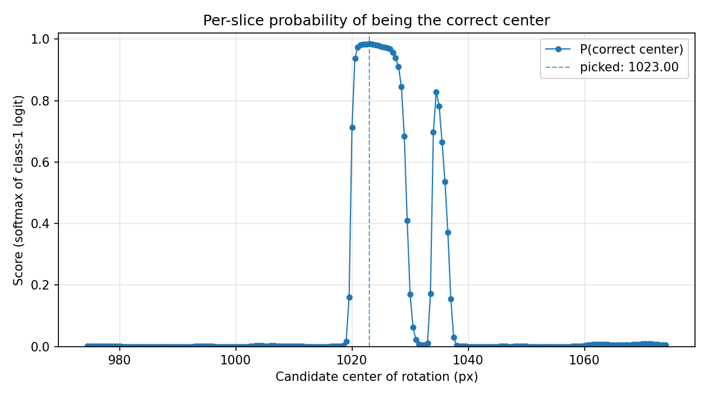

# tomo-center

Standalone AI rotation-axis center picker and fine-tuner for pre-reconstructed
TIFF slices.

The model and inference code are **vendored from
[tomocupy/develop](https://github.com/stang292/tomocupy/tree/develop/src/tomocupy/ai)**
(BSD-3, UChicago Argonne LLC). This repo packages just the bits needed to run
the classifier outside the full `tomocupy` reconstruction stack — no CUDA build,
no SWIG, no HDF5 reader.

Two subcommands:

| Command | What it does |
| --- | --- |
| `tomo-center find`  | Score a folder of reconstructed slices (one per candidate center) and report the best center. |
| `tomo-center train` | Fine-tune the shipped checkpoint to tomograms. |

## Install

Use a dedicated conda env — `torch` and a pinned `numpy<2` would conflict with
most existing envs.

```bash
conda create -n tomo-center python=3.10 pip -y
conda activate tomo-center
pip install -e /path/to/tomo-center
```

The editable install pulls every runtime dep declared in `pyproject.toml`:

| Package    | Why                                                          |
| ---------- | ------------------------------------------------------------ |
| `numpy<2`  | array ops; pinned because `torch 2.2.x` wheels were built against NumPy 1.x |
| `pillow`   | image resize (PIL `Image.fromarray` / `BILINEAR`) inside the inference pipeline |
| `tifffile` | reading TIFF slices from the input folder                    |
| `torch`    | DINOv2 backbone + adaptive pooling layers + classifier head  |
| `einops`   | tensor rearrange used inside `model_archs.py`                |

GPU is automatic when CUDA is available — install the matching `torch` CUDA
wheel for your system (see https://pytorch.org/get-started). CPU works but is
slow.
```bash
pip install torch==2.2.1 torchvision==0.17.1 torchaudio==2.2.1 --index-url https://download.pytorch.org/whl/cu121
```

## Get the model checkpoint

```
https://anl.box.com/s/k85a89kyplzd56hnjudw4ergt6ojfhoa
```

## `find` — pick the best center

```bash
tomo-center find /path/to/recons \
    --model-path /path/to/model.pt \
    --out-dir    /path/to/out
```

### Example

200 slices reconstructed at centers 974.5–1074.0, run on tomo4 (GPU):

```console
$ tomo-center find \
    /data2/2BM/2023-04/Strumendo-2023-04_rec/try_center/CaCO3room_001/ \
    --model-path /home/beams/2BMB/models/datav2_518_full_finetune.pt \
    --out-dir    ~/tomo-center-out/CaCO3room_001 \
    --plot
2026-06-05 20:03:03,134 - Loading TIFFs from /data2/2BM/.../CaCO3room_001 ...
2026-06-05 20:03:05,058 -   200 slices, shape (2048, 2048), dtype float32
2026-06-05 20:03:05,059 -   center range: 974.5 .. 1074.0
2026-06-05 20:03:06,894 - starting model inference...
2026-06-05 20:03:06,894 - Downsample factor is 1. No resizing applied.
2026-06-05 20:03:11,113 - done. Elapsed time is 4.22 s.
2026-06-05 20:03:11,121 - Best center(s):
2026-06-05 20:03:11,121 -   1023.0
```

Score curve written to `<out-dir>/scores.png`:



### How centers are paired with TIFFs

By default the **last numeric token in each filename stem** is used as that
slice's candidate center, e.g. `recon_0001_1234.50.tif → 1234.5`.

If your filenames don't carry the center, supply a sidecar file:

```bash
tomo-center find /path/to/recons \
    --model-path /path/to/model.pt \
    --centers-file centers.txt
```

`centers.txt` is one float per line, in the same sorted order as the TIFFs.
Lines starting with `#` are ignored.

### Multi-scale inference

The upstream pipeline supports running multiple `(downsample, num_windows, window_size)`
scales and combining their features for optimal accuracy. Pass matching-length lists:

```bash
tomo-center find /path/to/recons --model-path model.pt \
    --downsample-factor 1 2 \
    --num-windows       4 4 \
    --window-size       224 224
```

### Output

- `center_of_rotation.txt` — one center per line (appended, not overwritten).
- `predicts_all.npz` — raw model logits + the center list, if
  `--save-intermediate` is passed.
- `scores.png` (or a custom path) — per-slice probability vs. candidate
  center, if `--plot` is passed.

### Diagnostic plot

```bash
pip install -e '.[plot]'              # adds matplotlib

tomo-center find /path/to/recons --model-path model.pt --plot
# → <out-dir>/scores.png, opens an interactive window if $DISPLAY is set
```

A sharp peak with neighbors tapering off → confident pick (see the
[example](#example) above). Configure --num-windows and --window-size to balance computation and accuracy.

## `train` — fine-tune the model

Use this to adapt the shipped checkpoint to tomograms. Supports both full fine tuning and fine tuning the task-specific layers. In the latter scenario, only the
**light-weighted pooling weights and the classifier head** are trained.

### Data layout
#### Images

```
root/
  caseA/
    ...
    sampleA_1023.0.tif
    sampleA_1023.5.tif
    sampleA_1024.0.tif
    ...
  caseB/
    ...
    sampleB_980.0.tif
    sampleB_980.5.tif
    sampleB_981.0.tif
    sampleB_981.5.tif
    ...
```

Each TIFF is one 2D reconstructed slice.
#### Metadata
```
caseA 1012.0 (2424,2424)
caseB 1012.5 (2424,2424)
...
```

Metadata are recorded in .txt files, one per root directory. Each line corresponds to an individual case (sub-directory under the root directory containing the TIFFs) and consists of the sub-directory name, the actual center-of-rotation value, and the 2-D image size. 

#### Tomocupy

`tomocupy recon ... --reconstruction-type try` writes:

```
.../try_center/<SAMPLE>/recon_<CENTER>.tif
```

— sample in the folder, center in the file. The above training image file structures is compatible with tomocupy reconstruction.


#### Other facilities / other reconstruction tools

The recipe above is the template. `tomo-center train` requires at minimum:

1. Files live in `.../try_center/<SAMPLE>`, with one metadata file and one enlarge factor (for training data up-sampling) per `.../try_center/` root directory. Multiple root directories and metadata files are supported and their numbers should match.
2. Image files are TIFF (`.tif` / `.tiff`).
3. Names are unique within their subfolder — `<sample>_<center>.tif` is a safe
   convention.

Adapt the source path and the `cp` line to your facility's output layout (e.g.
Diamond's `savu`, ESRF's `nabu`, ALS's `tomopy` scripts — all use slightly
different folder/filename schemes).

### Run

```bash
tomo-center train --image-root /path/to/root1 /path/to/root2 ...\
    --meta-info-file /path/to/metadata1 /path/to/metadata2 ...\
    --enlarge-factor 1 1 ...\
    --resume /path/to/datav2_518_full_finetune.pt \
    --out    /path/to/finetuned_model.pt
```
By default, the model is fully fine-tuned. To freeze the backbone ViT and only fine-tune the task-specific weights, run:
```bash
tomo-center train --image-root /path/to/root1 /path/to/root2 ...\
    --meta-info-file /path/to/metadata1 /path/to/metadata2 ...\
    --enlarge-factor 1 1 ...\
    --resume /path/to/datav2_518_full_finetune.pt \
    --out    /path/to/finetuned_model.pt
    --freeze-backbone-ok
```
### Defaults and key flags

| Flag | Default | Notes |
| --- | --- | --- |
| `--epochs` | 20 | Head-only training is fast — try a few values. |
| `--batch-size` | 2 | Bump up to fit GPU memory. |
| `--lr` | 5e-5 | AdamW. |
| `--val-split` | 0.1 | Held-out fraction for per-epoch val accuracy logging. |
| `--window-size` | 518 | Window size used to crop patches from the original tomograms. |
| `--num-windows` | 24 | When set involks multi-instance learning. |
| `--no-augment` | off | By default training uses random horizontal flip. |
| `--base-model` | `dinov2_vitb14` | Backbone variant for the (rare) from-scratch path. |

### Output

A `.pt` file at `--out`, saved only when val accuracy improves. Structure:

```python
{"epoch": ..., "state_dict": ..., "args": {...}, "val_acc": ...}
```

Load it back with `tomo-center find --model-path <out>.pt`.

### Hub access on offline boxes

When `--resume` is **not** given, `train` calls
`torch.hub.load('facebookresearch/dinov2', ...)`, which goes to the internet.
On private networks (e.g., APS `tomo4`) this fails with a clear error message —
use `--resume` instead.

## Attribution

- `src/tomo_center/ai/inference.py` — vendored from
  `tomocupy/src/tomocupy/ai/inference.py`. Changes vs. upstream: internal
  import path; switched `print()` to the package logger; fixed an
  `UnboundLocalError` in the single-instance branch (`patch_corner` →
  `patch_corners`).
- `src/tomo_center/ai/model_archs.py` — vendored verbatim from
  `tomocupy/src/tomocupy/ai/model_archs.py`. It in turn includes a DINOv2 ViT
  (Apache-2.0, Meta) and attention pooling (MIT, Ilse & Tomczak).
- `src/tomo_center/logging.py` — adapted from
  `tomocupy/src/tomocupy/logging.py` (same colored-console formatter, scoped
  to the `tomo_center.*` logger tree).
- `src/tomo_center/train.py` — new. Single-GPU head-only fine-tune harness;
  the AdamW gain/bias weight-decay split and cosine-LR-with-warmup recipe are
  borrowed from an internal training script by S. Tang.
- See `LICENSE` for the upstream BSD-3 terms.
